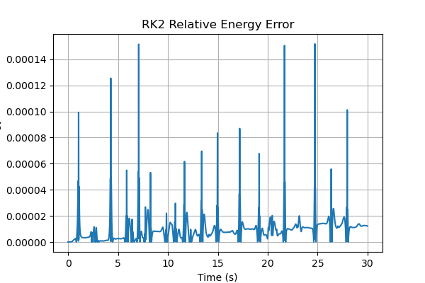

# RK2 Numerical Validation Report

## Purpose
Evaluate the numerical accuracy of the RK2 midpoint method used in the double-pendulum simulation.

## Method
Total mechanical energy was calculated as

E = T + V

and compared with the initial energy.

The relative energy error was calculated as

ε = |(E - E₀) / E₀|

## Test Conditions
- Timestep: 0.001 s
- Simulation duration: 30 s
- Initial conditions:
  - θ₁ = π
  - ω₁ = 0
  - θ₂ = π/2
  - ω₂ = 0

## Results

Maximum relative energy error:

1.58 × 10⁻⁴

or approximately:

0.0158%

## Discussion
The relative energy error remained small over the simulation. This indicates that the selected timestep provided good numerical stability for the current simulation.

## Conclusion
The RK2 implementation produced a numerically stable solution with less than 0.02% maximum relative energy error over the 30-second simulation.
